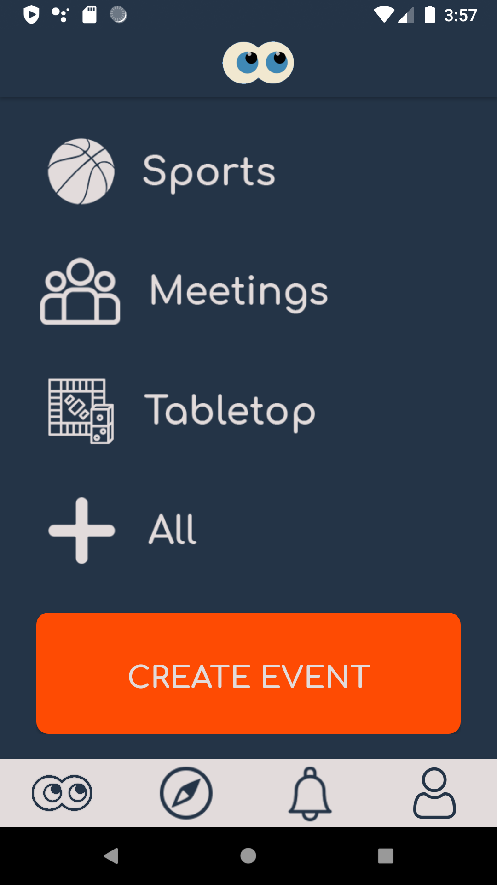
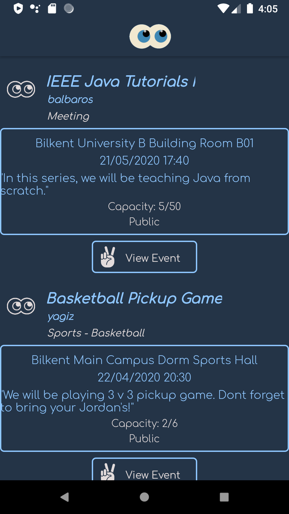
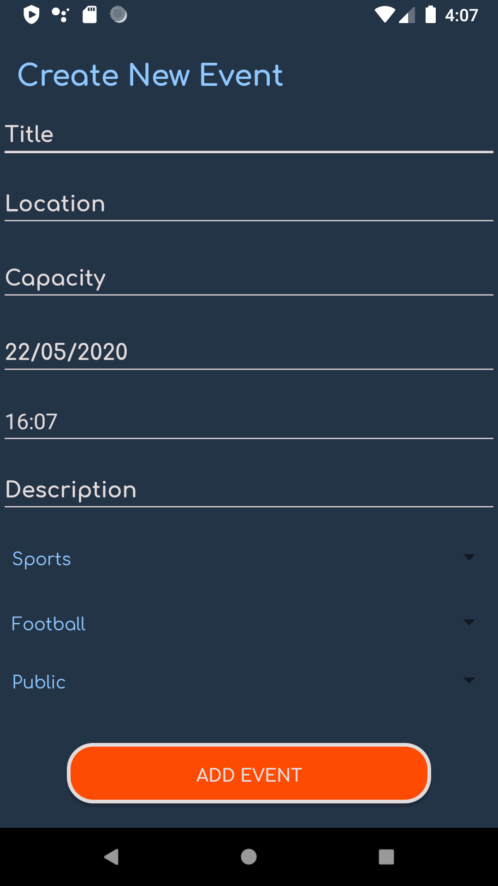
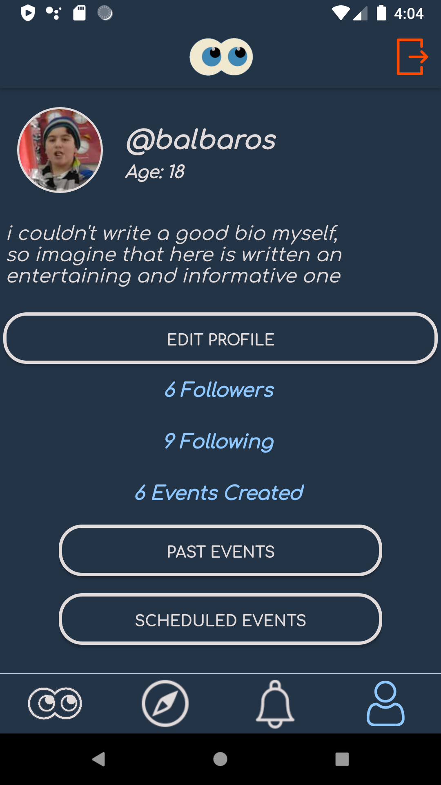
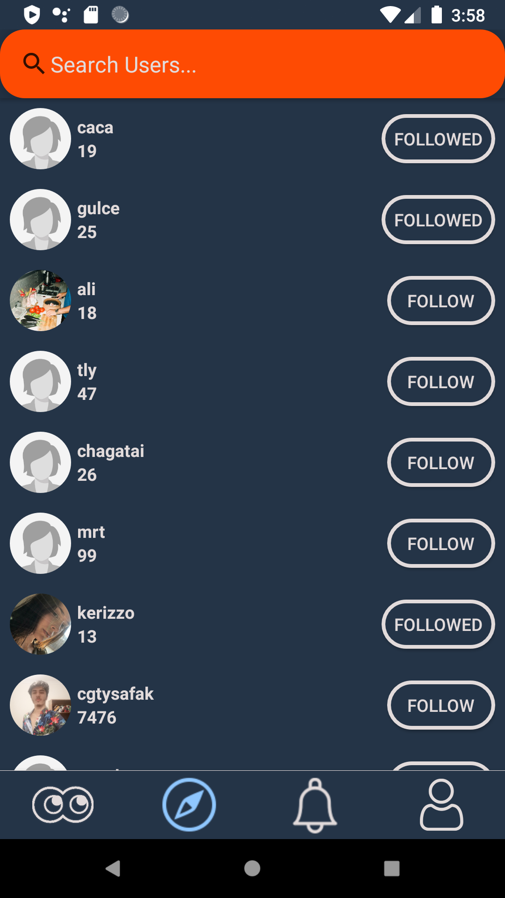
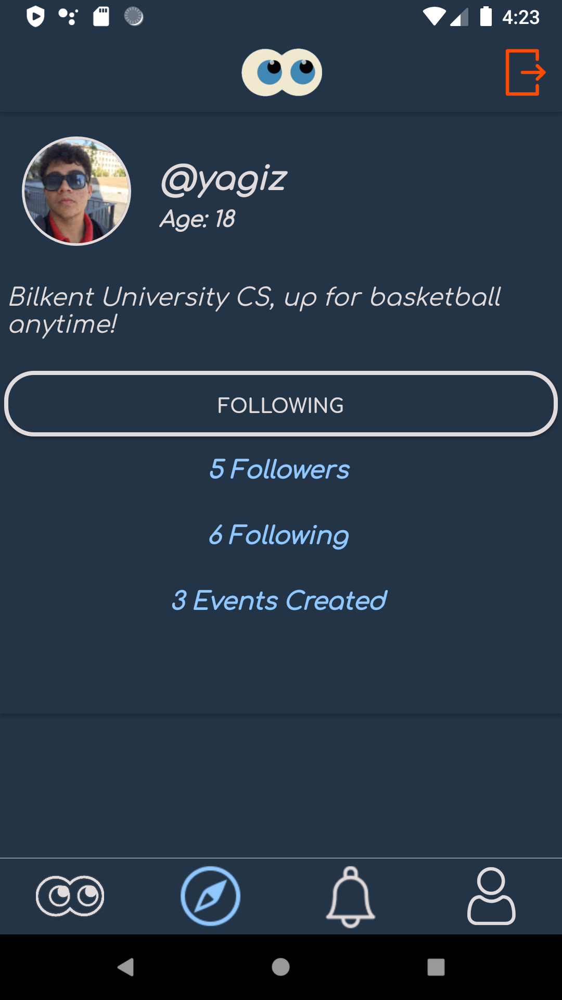
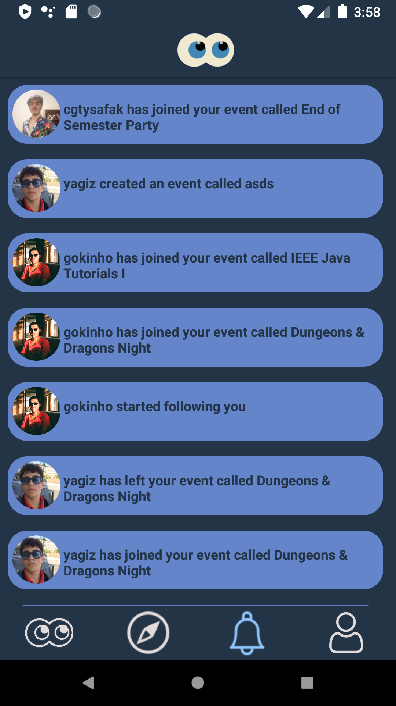

# CS102 ~ Design Project ~ Spring 2019/20
[Computer Engineering Department, Bilkent University](http://w3.cs.bilkent.edu.tr/en/).  
The information and code in this repository are submitted in partial fulfillment of the CS102 Semester Design Project. Except where explicitly stated, the work is that of the group members listed below (who are expected to follow ethical academic & professional practice).
****
## g2A ~~ Who's In? ~~
****
### ~ NeinNine ~

## Project Description
 "Who's In?" is a mobile application aiming to provide easy means of finding users for activities such as sports events, tournaments and club meetings.

 We know that finding people to play a basketball match, do a movie night or play Monopoly is often difficult, especially for university students like us. To solve this problem, we have developed "Who's In?".

 From the home screen, you can...
 

 ...list events and pick one to join...
 

 ...or create one yourself!
 

 Create and customize your profile to introduce yourself to others!
 

 Similarly, find your friends and other like-minded people and follow them!
  

 Check your notifications page regularly to be notified when people follow you and join or leave your event, or someone you follow creates one!
 

_Include a concise description of your project here. Be sure to include the proposed users, the architecture (eg. desktop, web, mobile, embedded, etc.) & screenshots when available._

## Project Status
+ **Group/project Selection:** completed (18.02.2020)
+ **Requirements:** completed (15.03.2020)
+ **UI Design:** completed (30.03.2020)
+ **Detailed Design:** completed (23.04.2020)
+ **Implementation:** done
+ **Reflections:** not yet!

[Group Meetings Log](group/meetingslog.md)
#### Group Members
- [Kutay Demiray       - 21901815](group/kutayDemiray_log.md)

- [Gökberk Keskinkılıç - 21801666](group/GokberkKeskinkilic_log.md)

- [Cemhan Kaan Özaltan - 21902695](group/CemhanKaanOzaltan_log.md)

- [Ceyda Şahin         - 21903448](group/CeydaSahin_log.md)

- [Yağız Yaşar         - 21902951](group/YagizYasar_log.md)

- [Cagatay Safak       - 21902730](group/CagataySafak_log.md)

- Gülin Yılmaz        - 21903057

****
**Instructor:** David Davenport   **TA:**  Bayram Berdiyev
****
